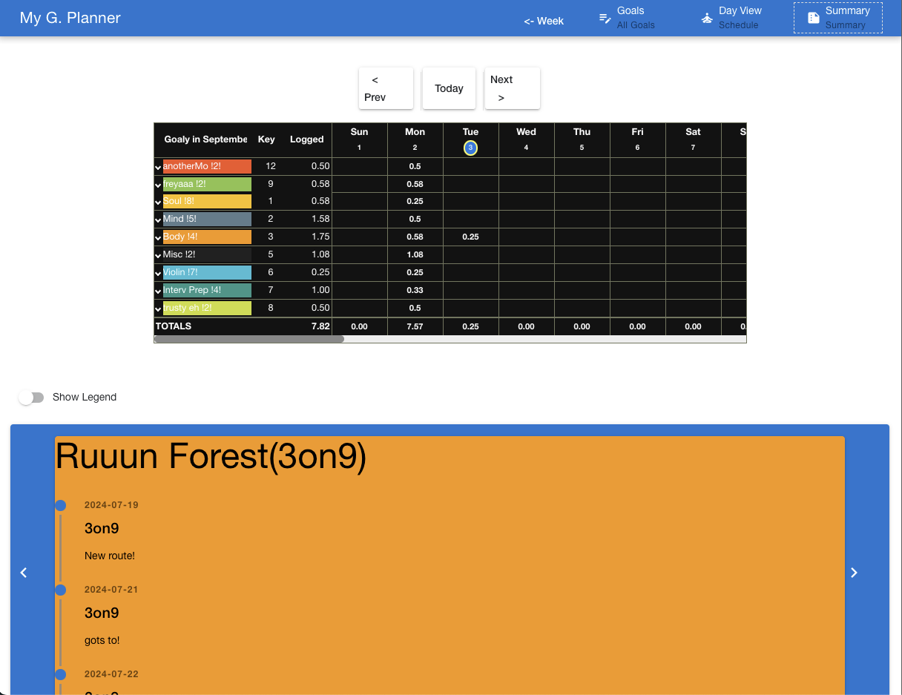
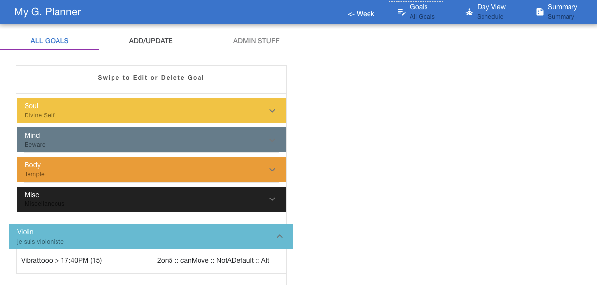
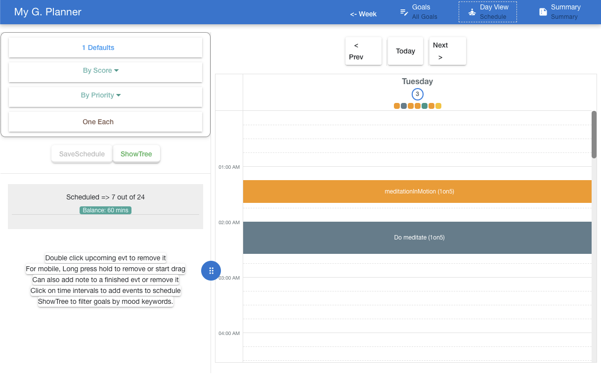

# My goal planner

Did you know, on average one has 3400 weeks before going to meet our maker? :D

### The Why

This ongoing project, using [Quasar framework](https://quasar.dev/), built on top of VueJS, is a frontend Web application that helps keep track of my personal goals and schedule activities centered on those goals in a calendar. With the goal to eventually make it a personal offline Android appline with Capacitor --hence the reason for using Quasar that integrates it as a plugin. It is also a great way to get reacquainted with Javascript and especially to use VueJS. 

### The What and How

Starting from the Quasar's boilerplate, a simple form page to add/edit goals is used. Then using a [calendar library](https://qcalendar.netlify.app/), a calendar view to show what activities/events are scheduled on the current day in view. The user can drag and move a scheduled event to a better time in the day calendar--potentially re-orgarnizing the day's schedule(with the exception of some predefined goal events that cannot be moved and requiere confirmation).

Goals are defined in my own way of course and they usually have some subgoals (these are the ones that actually get scheduled). Currently a subgoal has a score that ideally should be updated whenever it is felt that progress has been made for that specific subgoal and accomplishing the parent goal is within reach.

# :compass: App Images
</img>
</img>

</img>
</img>

[//]: # (Function)
## :dart: Features

* [x] Goal under a parentGoal which has priority and color code for visualization
* [x] Goal schedulable with attribute such as score,default,alternative and mood keywords that can be updated and used when auto-scheduling
* [x] Scheduling options:per parentGoal's priority,score,default or filter by mood keywords
* [x] Other scheduling options: by ad-hoc event add or choosing from existing goals
* [x] Drag/drop to reorder, add/remove scheduled event
* [x] Can add minutes to or end an ongoing event
* [x] Note/score can be updated after event is complete and shown via timeline in Summary view
* [x] Balance penalty when removing event with a choice of alternative events as replacement. Choice to use balance when scheduling a new event 
* [x] Week view calendar
* [x] Summary view for a unified month total per goal
* [x] Admin tool to edit goals, import raw json text data, reset data 

### Now! And Next...

The working app, hosted via github pages, is [here](https://fmcyamwe.github.io/gplanner/).
The minified production code was put into a different [repo](https://github.com/fmcyamwe/gplanner) while I was exploring ways to deploy the app with minimal cost--Thank you Github!

I would like to add local notifications for Android to allow more scheduling capability in case an event drags on longer (or shorter and move on to the next scheduled event). A definite todo also is using a central database as each device (and browser) keeps a local copy of the data for now, which defeats the purpose of the summary tracking for all goals :D 

All in due time... now on to set some goals and use this thing to grow!!!

